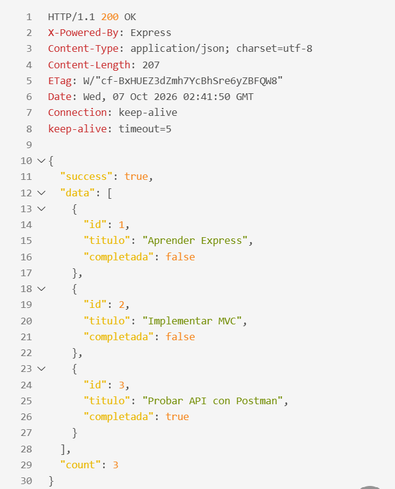
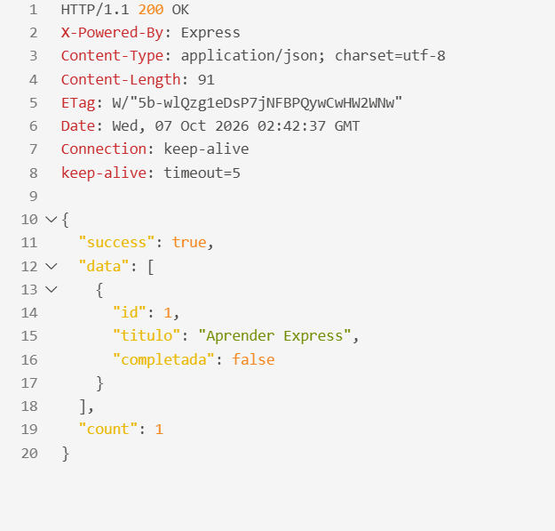
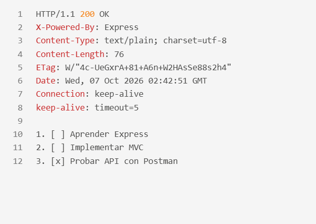
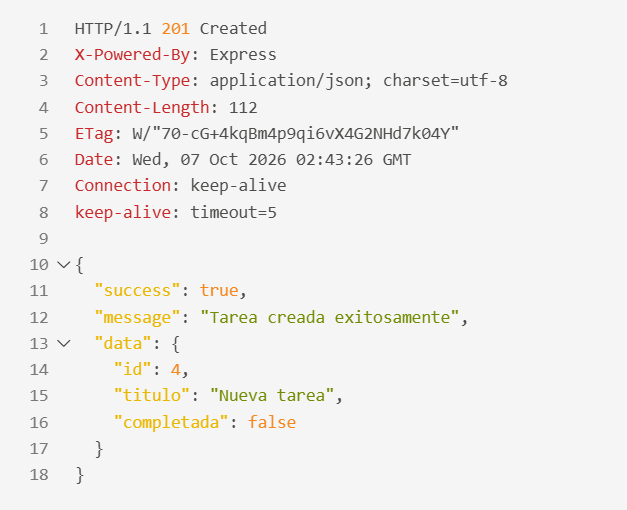
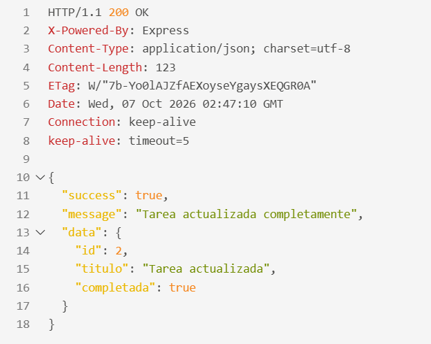
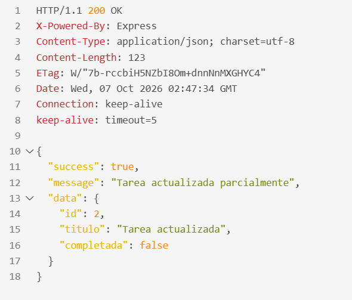
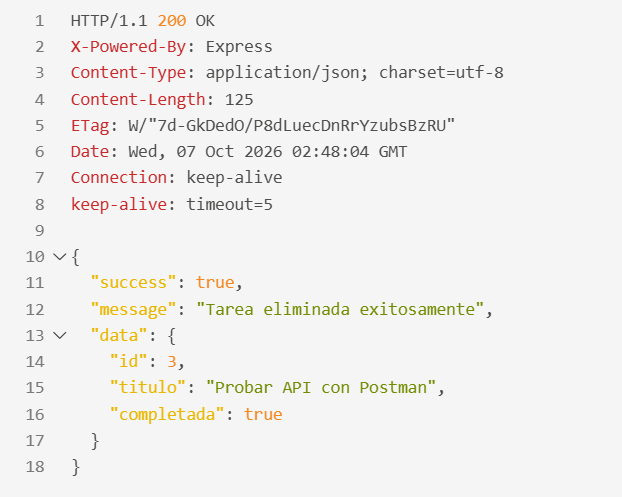
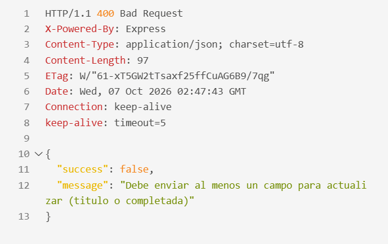
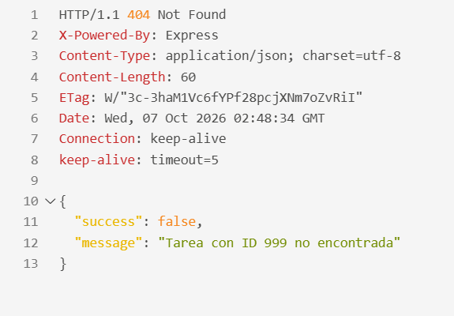

# API de Tareas (Express + MVC)
API REST para la gestión de tareas, desarrollada con Express y organizada mediante el patrón de diseño Modelo Vista Controlador. Las tareas estan almacenadas en memoria, por lo que se reinician los datos cada que el servidor es reiniciado.
 
## Características
 
- GET, POST, PUT, PATCH y DELETE
- Estructura Modelo Vista Controlador
- Módulos ES6 (`import` / `export`)
- Validación de datos de entrada y códigos de estado HTTP
- Búsqueda de tareas por título
- Respuesta en JSON o texto plano con `?formato=json|text`

## Requisitos
 
- Node.js 18 o superior
- pnpm / npm

## Instalación

En caso de que pnpm no funcione, intentar con npm
 
```bash
git clone <https://github.com/AmericaGabrielCazaresMasse/Meta_3.1_DAW>
cd api-tareas-mvc
pnpm install 
```
 
## Ejecución
 
```bash
pnpm run dev
```
 
El servidor esta disponible en `http://localhost:3000`. Para usar otro puerto, se debe definir la variable `PORT`.
 
## Estructura del proyecto
 
```
api-tareas-mvc/
├── src/
│   ├── models/
│   │   └── tarea.model.js        # Datos y lógica
│   ├── controllers/
│   │   └── tarea.controller.js   # Manejo de peticiones y respuestas
│   ├── routes/
│   │   └── tarea.routes.js       # Definición de endpoints
│   └── app.js                    # Configuración de Express
├── capturas/                     # Capturas de las pruebas
├── test-collection.http          # Colección de pruebas (REST Client)
├── package.json
└── server.js                     # Punto de entrada
```
 
## Endpoints
 
| Método | Endpoint | Descripción | Código de éxito |
|---|---|---|---|
| GET | `/` | Información de la API | 200 |
| GET | `/api/tareas` | Obtener todas las tareas | 200 |
| GET | `/api/tareas?formato=text` | Obtener todas en texto plano | 200 |
| GET | `/api/tareas/buscar?q=texto` | Buscar tareas por título | 200 |
| GET | `/api/tareas/:id` | Obtener una tarea por ID | 200 |
| POST | `/api/tareas` | Crear una tarea | 201 |
| PUT | `/api/tareas/:id` | Reemplazar una tarea completa | 200 |
| PATCH | `/api/tareas/:id` | Actualizar campos específicos | 200 |
| DELETE | `/api/tareas/:id` | Eliminar una tarea | 200 |
 
### Modelo de datos
 
```json
{
  "id": 1,
  "titulo": "Aprender Express",
  "completada": false
}
```
 
| Campo | Tipo | Notas |
|---|---|---|
| `id` | número | Generado automáticamente |
| `titulo` | texto | Requerido, no puede estar vacío |
| `completada` | booleano | Opcional, por defecto `false` |
 
### Ejemplos
 
**Crear una tarea**
 
```http
POST /api/tareas
Content-Type: application/json
 
{ "titulo": "Nueva tarea", "completada": false }
```
 
```json
{
  "success": true,
  "message": "Tarea creada exitosamente",
  "data": { "id": 4, "titulo": "Nueva tarea", "completada": false }
}
```
 
**Buscar por título**
 
```http
GET /api/tareas/buscar?q=express
```
 
```json
{
  "success": true,
  "data": [{ "id": 1, "titulo": "Aprender Express", "completada": false }],
  "count": 1
}
```
 
**Respuesta en texto plano**
 
```http
GET /api/tareas?formato=text
```
 
```
1. [ ] Aprender Express
2. [ ] Implementar MVC
3. [x] Probar API con Postman
```
 
## Códigos de estado
 
| Código | Cuándo se usa |
|---|---|
| 200 OK | Consulta, actualización o eliminación exitosa |
| 201 Created | Tarea creada exitosamente |
| 400 Bad Request | ID inválido, `titulo` ausente o vacío, `completada` no booleano, falta `q` en la búsqueda, PATCH sin campos |
| 404 Not Found | La tarea o la ruta no existe |
| 500 Internal Server Error | Error inesperado del servidor |
 
## Pruebas
 
El archivo [`test-collection.http`](test-collection.http) contiene una petición por cada endpoint, se incluyen los casos de error (400 y 404). Para usarlo:
 
1. Instalar la extensión **REST Client** en VS Code.
2. Inicia el servidor con `pnpm run dev` o `npm run dev`.
3. Abre `test-collection.http` y haz clic en **Send Request** sobre cada petición.

### Capturas de pantalla
 
**GET /api/tareas**
 

 
**GET /api/tareas/buscar?q=express**
 

 
**GET /api/tareas?formato=text**
 

 
**POST /api/tareas**
 

 
**PUT /api/tareas/:id**
 

 
**PATCH /api/tareas/:id**
 

 
**DELETE /api/tareas/:id**
 

 
**Error 400 (ID inválido)**
 

 
**Error 404 (tarea no encontrada)**
 

 
### Alumno(a):
 Cazares Masse America Gabriel
 
